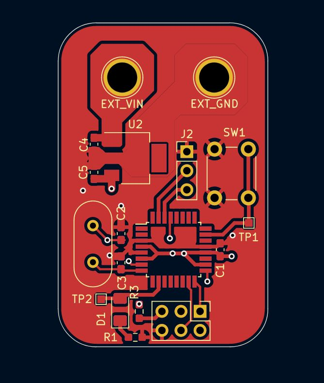
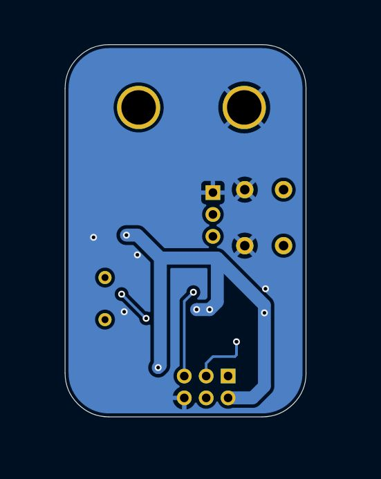

## Fall 2023 Intro Project (Fancy button!)

### Functionality

Using limited components, this project aims to establish a new precedent for extremely satisfying LED control. Based on the requirements set by the intro project guidelines, this board can:

 - Independently toggle the state of an LED through a button press
 - Receive brightness commands over UART from another device
 - Send status and update information over UART to another device
 - Smoothly transition between brightness levels
 - (Theoretically) take 7-25v DC input and regulate to 5v DC

### Hardware

This board uses the ATMEGA328P-A mcu for the heavy lifting, and an uA7805 linear 5v VR for power. It was designed to use a 16MHz external crystal, but due to myself being cheap, all testing was done on the Mcu's internal 8MHz ocsillator.

#### BOM

Below is a rough bill of materials for this project. Note that specific part numbers have been excluded for passive components:

 - (x2)	22 pF Ceramic Capacitor (0603 SMT Package)
 - (x1) 16.00MHz Osc.
 - (x1) 0.33uF Ceramic Capacitor (0603 SMT Package)
 - (x1) 0.10uF Ceramic Capacitor (0603 SMT Package)
 - (x1) 0.047uF Ceramic Capacitor (0603 SMT Package)
 - (x1) 10k Ohm Resistor (0603 SMT Package)
 - (x1) 330 Ohm Resistor (0603 SMT Package)
 - (x1) Push button (6mm 4 pin thru hole package)
 - (x1) UA7805 Series Linear VR 5v
 - (x1) ATMega328P-A Microcontroller
 - (x1) LED (SMT 1206 Package)
 - (x1) AVR-ISP-6 Header
 - (x1) 2.54mm 1x3 Pin Header

#### PCB Design

The PCB was designed to be space efficient, with different 'parts' of the circuit organized together. All MCU-related components are nearby one another and separate from the power side of the board. This layout minimizes un-needed track length. A front and back ground plane is used along with large 1.5mm 5v tracks to supply power to all components on the board. The ground planes also reduces the amount material required to be removed from the board during manufacturing.

The ATMega328P supplies internal pullup resistors on each pin, so the button does not need an external resistor in order to function. This (along with the internal crystal) further reduces component cost. 

The UA7805 Linear VR was chosen due to its wide input range, but also because (in theory) it should be able to handle the board spec 9-14v DC at low currents without thermally damaging itself (haven't tested it LMAO).
 
### Firmware

	Various libaries are available to make developing on the ATMega328P easier. Arduino is the most common for beginners, but thats LAME. AVR supplies its own library for development on this platform, and it has all sorts of neat and fun features... but thats LAME. Naturally, the only sane option was to spend way too much time dissecting the datasheet and implementing all required functionality from scratch, in C. This was the most challenging aspect of this project, as the only low-level code I had written in the past was 6502 ASM. However, that meant that the ATMega328P's memory mapped register design wasn't completely foreign.

	It was simply a matter of reading that datasheet. Until I needed to use interrupts. The most time consuming part of this process was attempting to bend the will of GCC to allow me to manually create an interrupt vector table-- a chunk of instructions telling the MCU where to jump for each interrupt. Several attempts, from function pointer arrays to compiler hacks, were attempted. The solution, it turns out, is the `__vector_#()` function format in combination with the `__attribute__((interrupt))` attribute. This provided the compiler with enough information to treat said functions as interrupts-- adding the correct interrupt boilerplate ASM at the beginning and `reti` instruction at the end. With that out of the way, I was able to create a preprocessor macro to simplify the creation of interrupt handlers. I then proceded to create only one interrupt handler.

After far too much time debugging interrupt and timer shenanigans, I had _just enough C ™_ to properly handle debouncing, PWM, smooth PWM transitions, and UART.

#### A Note About Debouncing

There are various methods to debounce a button, however this specific implementation uses a 16-bit 'accumulator' word and a FCU/1024 prescaled timer in CTC mode. The interrupt that this timer calls periodically is used to poll the button, shift its value into the accumulator, and then check if the accumulator has received 16 consecutive samples of '0' (Button pressed). If it has, the `LED_ON` variable is inverted and the accumulator is reset. This method ensures that no random button glitches are registered as valid presses.

#### A Note About PWM

The PWM timer used in this program is inverting. This is done as a workaround to an apparent hardware gltich that would result in some amount of voltage escaping at a 0% duty cycle. This would cause the LED to never go out. To fix this, a bit is flipped in the TCCR0A register resulting in an inverted PWM signal. Lookup tables are used to determine what duty cycle each key received over UART should translate to.

#### A Note About UART

Due to the flaky nature of the internall 8MHz clock, 115200 baud is- at best- shakey. To decrease the error%, U2Xn is set in the UBRRn register. This bit is described as 'ffectively doubling the transfer rate for asynchronous communication.' However for us, it decreases the error% from 8.5% to -3.5%. Still not great, but usable in a pinch.
